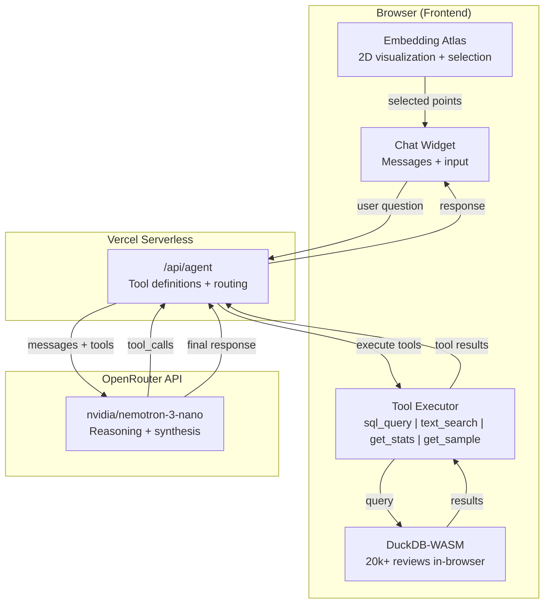

# Embedding Atlas - TripAdvisor Reviews Visualization

An interactive visualization and analysis tool for TripAdvisor hotel reviews using Apple's Embedding Atlas with an AI-powered analyst agent.

## Atlas Agent Demo

## Atlas Agent

The web app includes an AI analyst that can query and analyze the review dataset through natural language. Select points on the map and ask questions — the agent will execute queries and synthesize findings.

### Capabilities

| Feature | Description |
|---------|-------------|
| SQL Queries | Execute complex queries with aggregations, filters, and grouping |
| Text Search | Find reviews by keywords or phrases (case-insensitive) |
| Statistics | Get total counts, averages, and rating distributions |
| Sampling | Retrieve example reviews with optional rating filters |
| Summarization | Natural language synthesis of query results |

### Example Questions

- "What's the average rating of reviews mentioning breakfast?"
- "How many 1-star reviews are there? What do they complain about?"
- "Find reviews that mention 'noisy' or 'loud'"
- "Show me the rating distribution"
- "What are the common themes in negative reviews?"

### How It Works

1. **Select reviews** on the Atlas map using lasso or rectangle selection
2. **Ask a question** in the chat widget
3. The agent **calls tools** (SQL, text search, stats) to gather data
4. Results are **synthesized** into a natural language response

The agent uses a multi-step reasoning loop, executing up to 8 tool calls per request to answer complex questions.

### Architecture

## Features

- Interactive 2D embedding visualization with 20,000+ reviews
- Automatic cluster labeling and topic detection
- Lasso/rectangle selection for data exploration
- Real-time AI analysis of selected reviews
- Tool execution feedback in chat UI

## Tech Stack

| Component | Technology |
|-----------|------------|
| Visualization | Apple Embedding Atlas |
| Embeddings | Nomic Embed V1.5 |
| Data Engine | DuckDB-WASM + Mosaic |
| Frontend | React + TypeScript + Vite |
| Backend | Vercel Serverless Functions |
| LLM | OpenRouter API (nvidia/nemotron-3-nano) |

## Data Pipeline

1. `1_generate_embeddings_*.py` - Generate embeddings from review text
2. `2_reduce_dimensions.py` - UMAP projection to 2D
3. `3_visualize_atlas*.py` - Interactive visualization

## License

This project is licensed for **non-commercial use only**.

For commercial use, please contact the author for permission.

See [LICENSE](LICENSE) for details.
